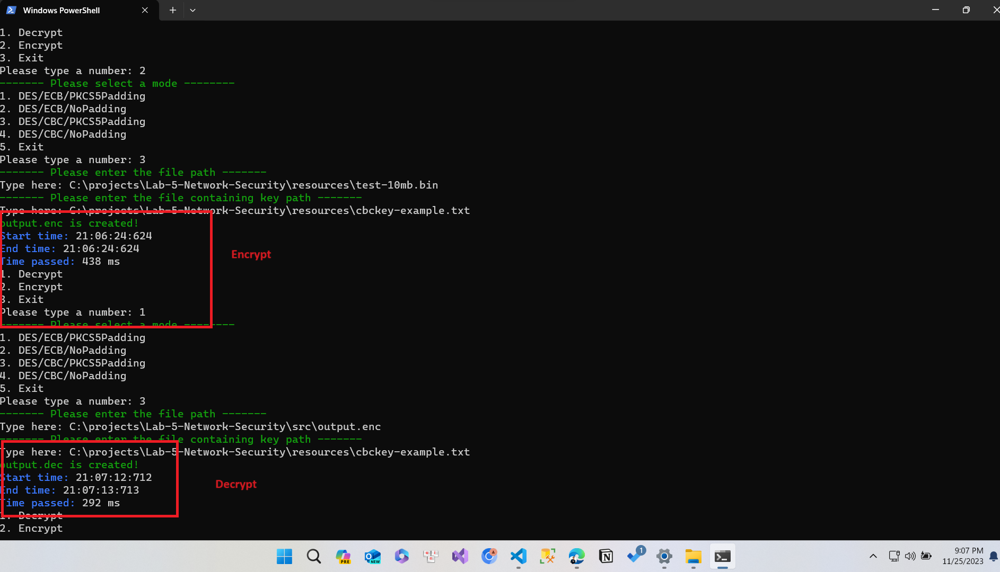
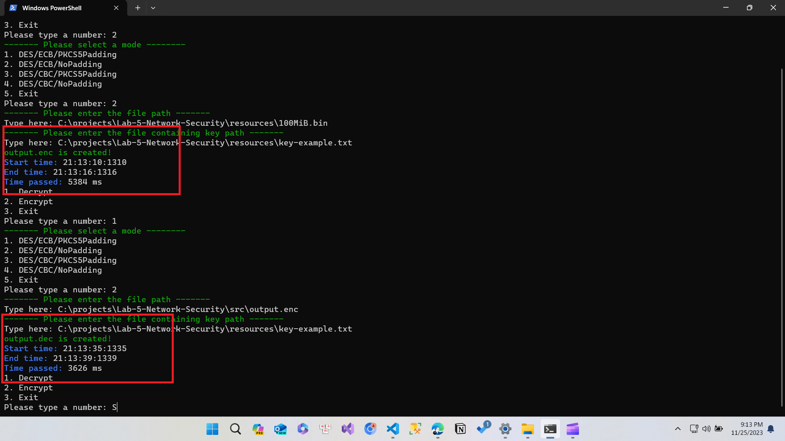
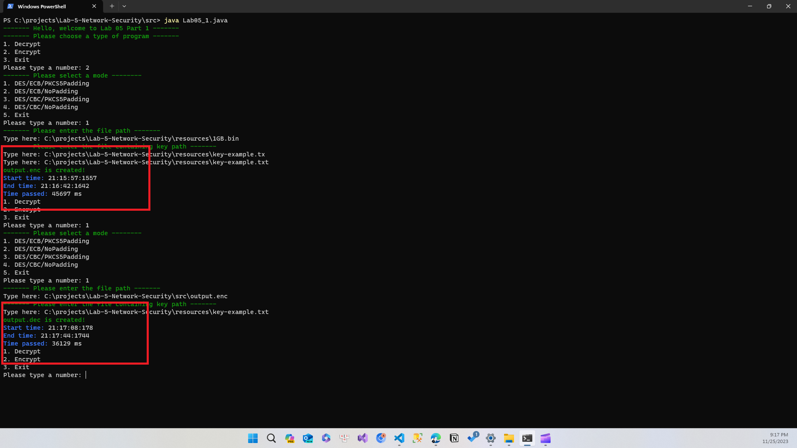
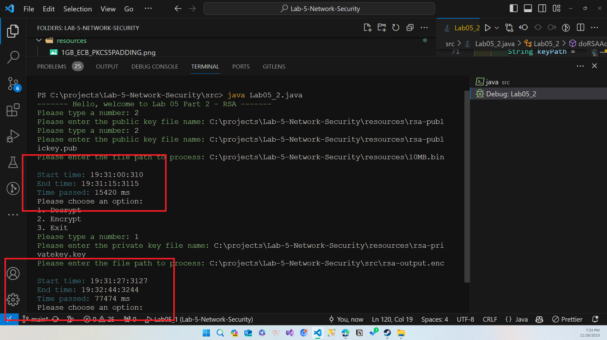

## Introduciton

- This code is used for educational purpose only. It is not intended to be used for any other purpose.
- This is implementation for **Lab 5** of *Network Security* (CO) programming at <a href="https://hcmut.edu.vn/">Ho Chi Minh City University of Technology</a>

## Folder Structure

The workspace contains two folders by default, where:

- `src`: the folder to maintain sources
- `resources`: contain any files that is ouptput or downloaded (e.g. images, text files, etc.)
- `tests`: the folder to maintain test cases


## About the Project
All files needed for exercise should be placed in resources file

### Exercies 1
- File `Lab05_1.java` is the main file
- File `PrintUtils.java` is the file that contains functions to print out the result in colors

#### About 
- This exercise is about **DES** encryption and decryption and different modes
- The program will read the key and content to do action on from `user's input` and output the result to `output.dec` if it is decryption or `output.enc` if it is encryption
- Measure execution time of selected [mode](https://manansingh.github.io/Cryptolab-Offline/c13-des-modes.html)

To compile, run following commands (You are at the `src` folder):
```powershell
javac Lab05_1.java PrintUtils.java
java Lab05_1
```
Or you can use any IDE to run the program.

> The output will be in `src` folder

Some results of the program
| 10mb file | 100mb file | 1GB file |
|----------|----------|----------|
|    |    |    |
| <small>Encrypted time: 438ms | <small>Encrypted time: 5384ms  | <small>Encrypted time: 45697ms  |
| <small>Decrypted time: 292ms |<small>Decrypted time: 3626ms  | <small>Decrypted time: 36129ms  |

### Exercise 2
- File `Lab05_2.java` is the main file
- The output will be either `rsa-output.enc` or `rsa-output.dec` depending on the action

Similarly to exercise 1, to compile, run following commands (You are at the `src` folder):
```powershell
javac Lab05_2.java PrintUtils.java
java Lab05_2
```
